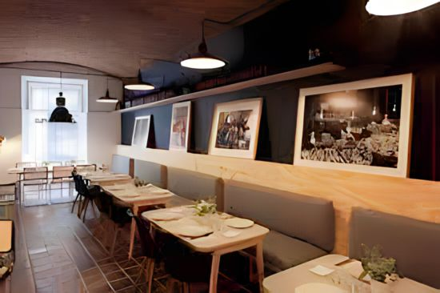

<h1> Nimrodel_Pub_Restaurant</h1>

  

  

    

<samp>
  
“Nimrodel Pub Restaurant es un oasis de calma y diversión, lleno de rincones acogedores en donde se resalta la belleza de su decoración élfica.
Es un lugar ideal para visitar solo o acompañado, disfrutar una tarde con amigos, terminar el día después del trabajo o almorzar con tu familia.
Puedes probar nuestras tradicionales tablas, en todas sus variedades y que nos han otorgado reconocimiento dentro de la cultura gastronómica.
También puedes disfrutar nuestras cervezas de fabricación propia, con sabores que te llevarán a un mágico mundo.”
  </samp>

## Propósito del Proyecto

Describe la razón por la que se hizo esto, por ejemplo:

*"Identificamos dos problemas principales: una escasez de donaciones de sangre y una desaceleración económica local. En medio del brote de COVID-19, los bancos de sangre necesitan donantes con urgencia. Las personas que son donantes potenciales calificados deben quedarse en casa y aislarse. A medida que las donaciones caen en picado y la demanda para los aumentos de sangre y plasma, los bancos de sangre están experimentando una escasez global pronunciada.*

*Además, la pandemia está afectando las economías locales debido a un bloqueo generalizado. Las pequeñas empresas que dependen de la comunidad local deben pensar en formas de incentivar a los clientes a comprar tan pronto como se levanten las restricciones ".*

## Tecnologías

- Html✨, 
- Javascript,
- Css,
- Bootstrap.

## Contribuyendo   

Si encuentra un error, informe los errores grandes y pequeños **abriendo un issue** `<https://ezelaya123.github.io/Nimrodel_Pub_Restaurant/>`

   

